# AI Mood Companion: A Web-Based Emotional Support Platform

MoodCompanion is a personal AI-powered application that helps users track their emotions, journal their thoughts, and find support. The app features mood tracking, digital journaling with emotion detection, and a community support system.

## Table of Contents

- [AI Mood Companion: A Web-Based Emotional Support Platform](#ai-mood-companion-a-web-based-emotional-support-platform)
  - [Table of Contents](#table-of-contents)
  - [Features](#features)
  - [Tech Stack](#tech-stack)
  - [Environment Configuration](#environment-configuration)
  - [Server](#server)
  - [Client](#client)
  - [Render URL](#render-url)
  - [Timeline](#timeline)
  - [Current State](#current-state)
    - [Iteration 1](#iteration-1)
    - [Iteration 2](#iteration-2)
    - [Iteration 3](#iteration-3)
  - [Contributions](#contributions)
    - [Iteration 1](#iteration-1-1)
    - [Iteration 2](#iteration-2-1)
    - [Iteration 3](#iteration-3-1)
  - [License](#license)

## Features

- **Mood Tracker**: Record and visualize your daily emotional states
- **Digital Journal**: AI-powered journaling with emotion analysis
- **AI Companion**: Get emotional support and personalized advice
- **Community Support**: Share thoughts anonymously with others

## Tech Stack

- **Frontend**: React
- **Backend**: Node.js, Express.js
- **Database**: MongoDB
- **APIs**: OpenAI, Google Cloud Natural Language API, Weather API
- **Deployment**: Render

## Environment Configuration

To run the web app locally, create a `.env` file with the following configurations:

**Frontend:**

```sh
VITE_API_URL=http://localhost:3000/api
VITE_WEATHER_API_KEY=your_weather_api_key
VITE_AUTH0_DOMAIN=your_auth0_domain
VITE_AUTH0_CLIENT_ID=your_auth0_client_id
VITE_AUTH0_AUDIENCE=your_auth0_audience
```

**Backend:**

```sh
MONGODB_URI=mongodb+srv://<username>:<password>@cluster0.mongodb.net/<dbname>?retryWrites=true&w=majority
JWT_SECRET=your_jwt_secret_key
PORT=3000
GOOGLE_API_KEY=your_google_cloud_natural_language_api_key
OPENAI_API_KEY=your_openai_api_key
CLOUDINARY_CLOUD_NAME=your_cloudinary_cloud_name
CLOUDINARY_API_KEY=your_cloudinary_api_key
CLOUDINARY_API_SECRET=your_cloudinary_api_secret
CLOUDINARY_URL=your_cloudinary_url
AUTH0_DOMAIN=your_auth0_domain
AUTH0_CLIENT_ID=your_auth0_client_id
AUTH0_CLIENT_SECRET=your_auth0_secret
PINECONE_API_KEY=your_pinecone_api_key
PINECONE_ENVIRONMENT=your_pinecone_environment
```

## Server

1. Install dependencies:

```bash
npm install
```

2. Start server:

```bash
nodemon server.js
```

## Client

1. Install dependencies:

```bash
npm install
```

2. Start client:

```bash
npm run dev
```

3. Open your browser and navigate to http://localhost:5173 (or some other port if port 5173 is already occupied, it will notify you).

## Render URL

- **Frontend**: [https://moodcompanion.onrender.com](https://moodcompanion.onrender.com)
- **Backend**: [https://moodcompanion-api.onrender.com](https://moodcompanion-api.onrender.com)

## Timeline

- Iteration 1 - Mar 25
- Iteration 2 - Apr 5
- Iteration 3 - Apr 16
- Final Project submission - Apr 17 (10:45 am)

## Current State

### Iteration 1

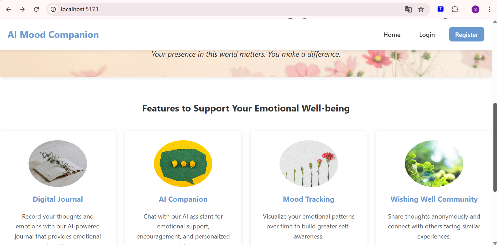

### Iteration 2

- **Login Home Page**:  
  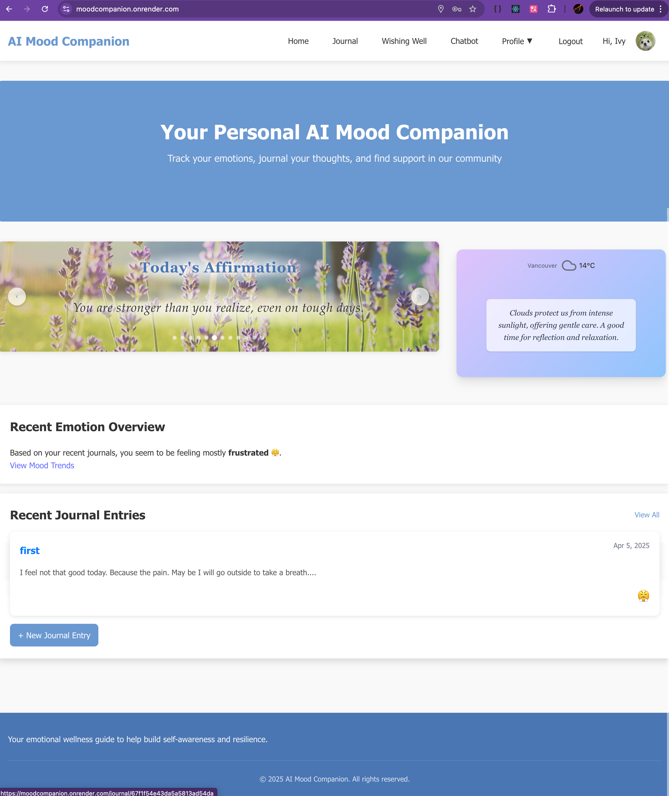
- **Logout Home Page**:  
  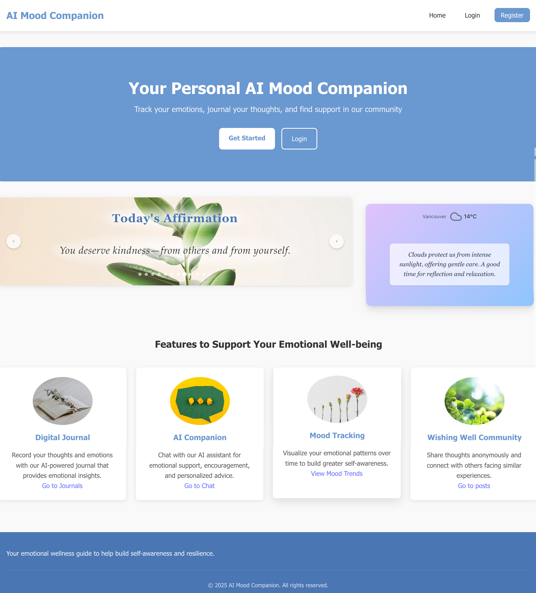
- **Other Pages**:  
  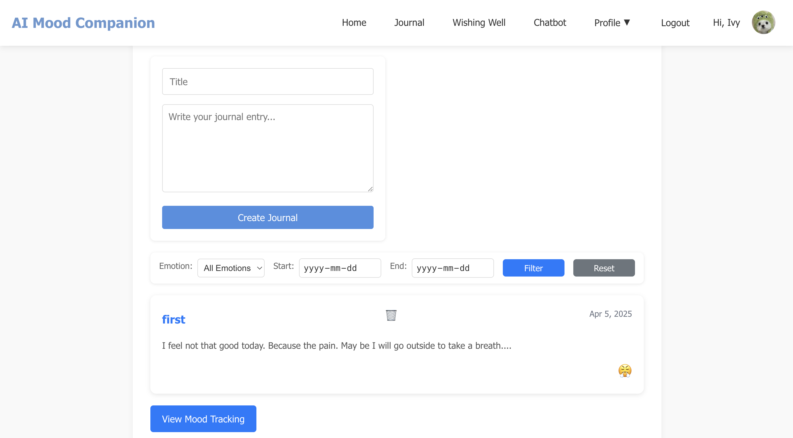  
  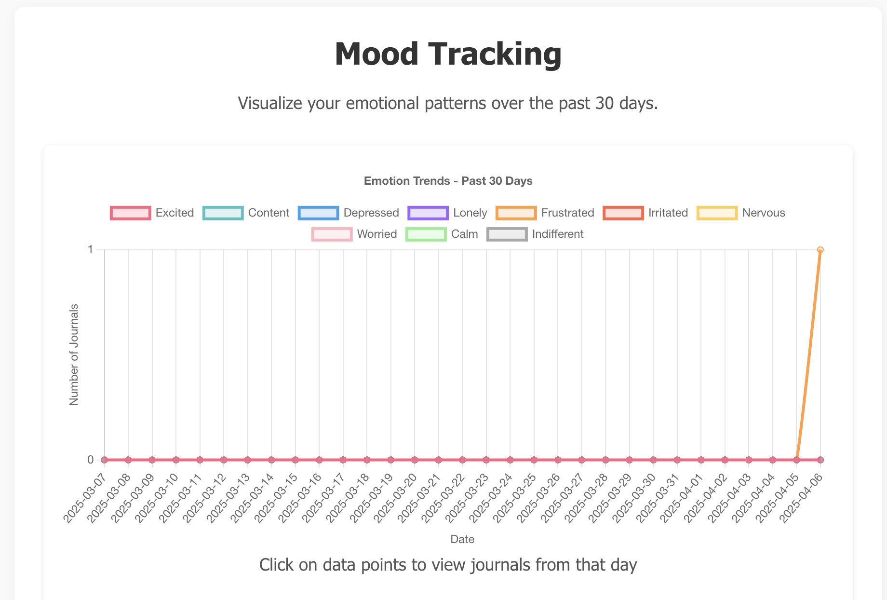  
  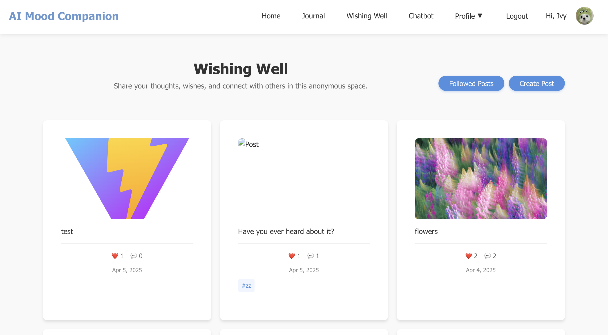  
  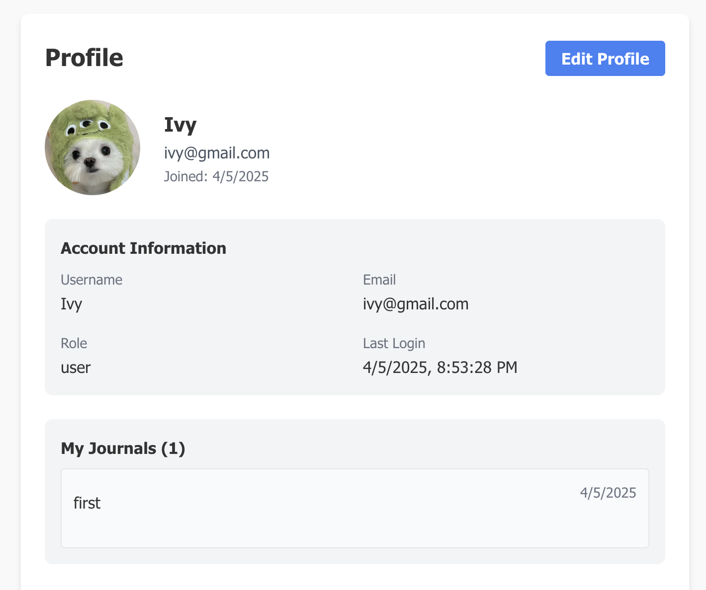
  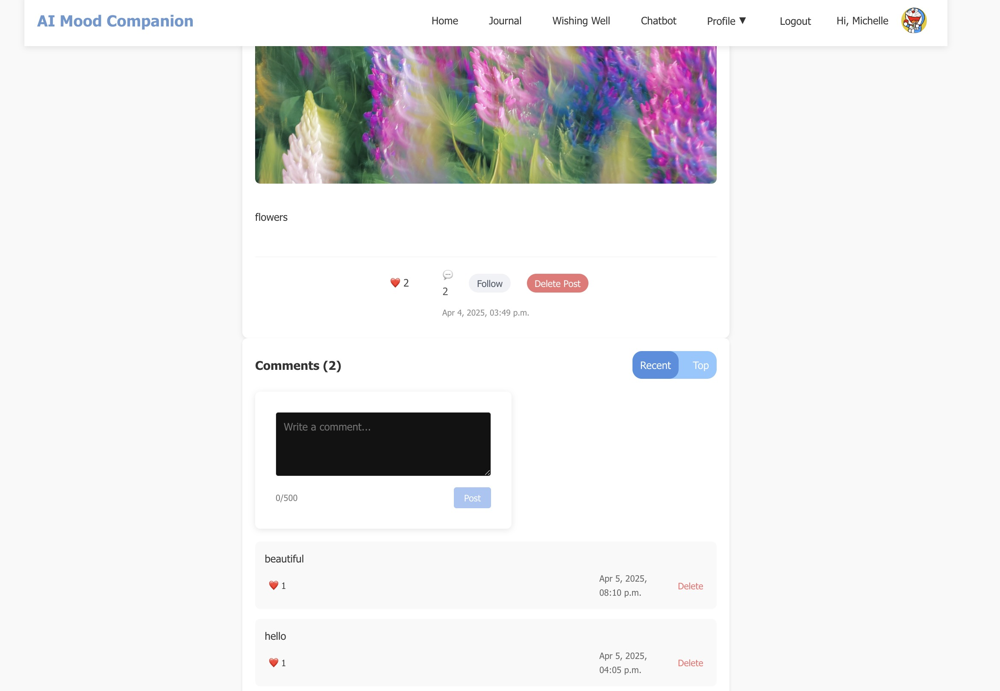  
  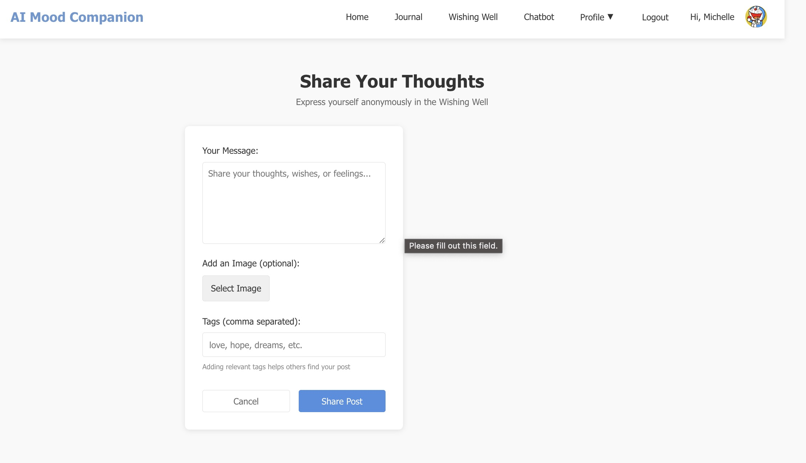  
  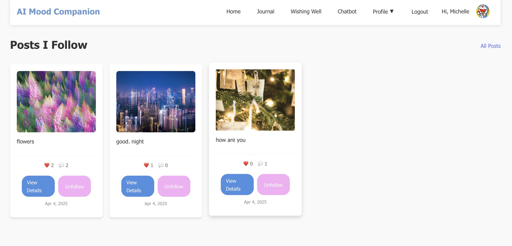

### Iteration 3

- **Login Home Page**:  
  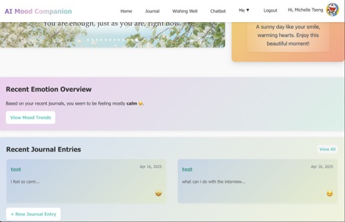
- **Logout Home Page**:  
  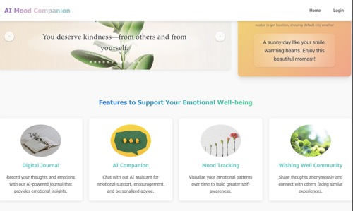
- **Mobile Size Page**:  
  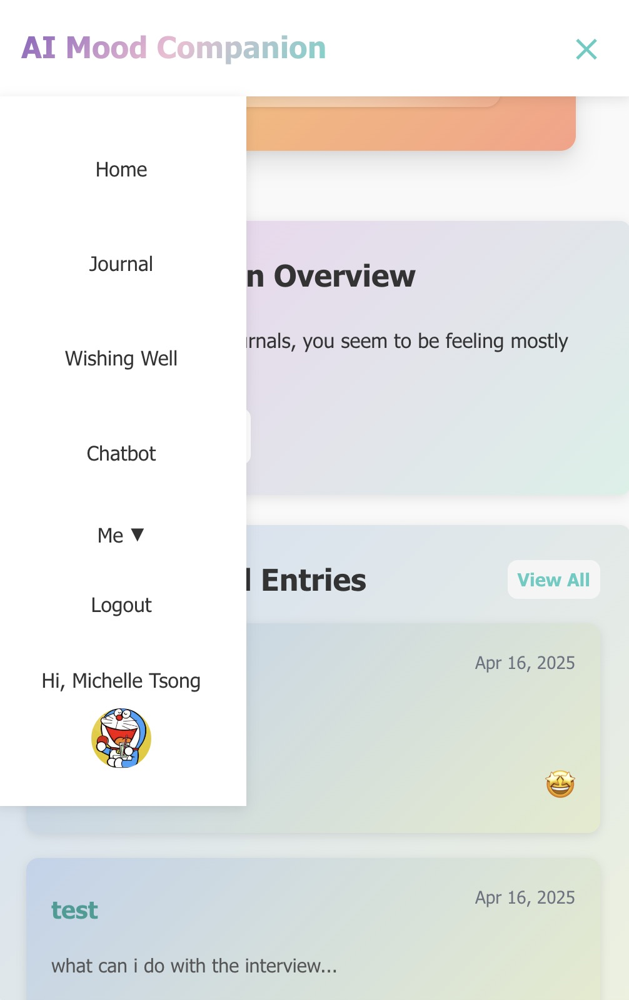
- **Other Pages**:  
  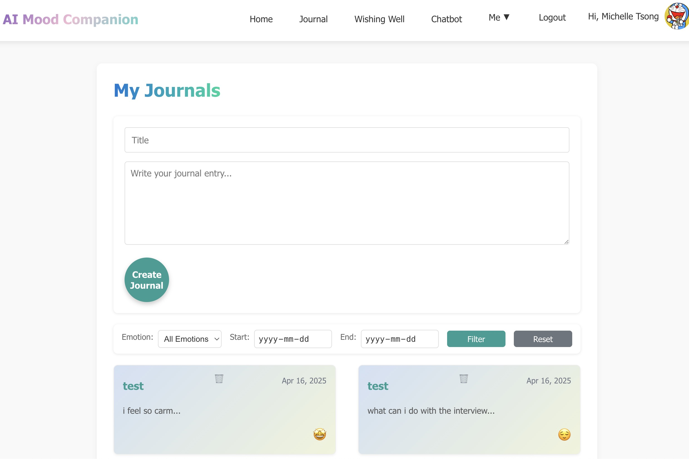
  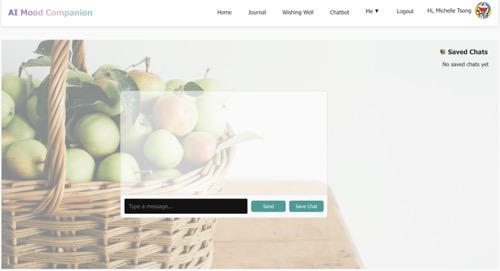  
  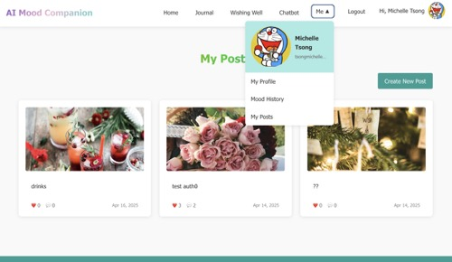

## Contributions

### Iteration 1

- **Minchao Cong**:Implement the backend, which includes four collections and the CRUD operations for the API, as well as the implementation of the posts list page and post detail page.
- **Fang Liu**: Implement the client side, including initializing the App file, deploying the homepage and journals page to support CRUD operations, and creating the login page for authentication.
- **Shurui Liu**: Implemented the register functionality.

### Iteration 2

- **Minchao Cong**:

  - **Post Interaction Features**: Enhanced the post detail page with comprehensive interaction capabilities:
    - Implemented comment system allowing users to add comments to posts
    - Added follow/unfollow functionality for user connections
    - Integrated upvote system for post engagement
    - Applied authentication requirements for comment visibility
    - Implemented permission controls so only post owners and comment owners can delete their content
  - **Post Media Integration**: Modified posts schema, routes, and controller methods:
    - Added image upload and storage functionality
    - Enabled users to publish posts with attached images
    - Optimized media handling for different device displays
  - **Homepage User Experience**: Designed an engaging homepage with dynamic elements:
    - Added carousel feature displaying motivational content
    - Implemented icon-based navigation for authenticated users
    - Integrated weather API companion that provides location-based forecasts with personalized comfort messages
  - **User Profile System**: Enhanced the user experience with profile customization:
    - Modified user schema to include avatar functionality
    - Created routes and controllers for profile image management
    - Added dropdown menu in navigation displaying user avatar
    - Developed interfaces for viewing and editing user information
  - **Error Handling Framework**: Optimized application stability and user feedback:
    - Implemented error boundary component for graceful error management

- **Fang Liu**:

  - **Journal Page CRUD**: Enhanced the journal page by fully implementing Create, Read, Update, and Delete (CRUD) functionality.
  - **Filtering Functionality**: Improved the journal filtering system for better user experience and data retrieval.
  - **Google Cloud Natural Language API Integration**: Integrated the Google Cloud Natural Language API to analyze the sentiment of journal entries, enabling mood tracking.
  - **Mood Tracking Page**: Developed a new mood tracking page to visualize users’ past emotions based on sentiment analysis.
  - **Frontend Error Handling**: Optimized error handling across the app:
    - Created a `NotFoundPage` component and configured routing in `App.jsx` to display a 404 page for invalid routes (e.g., `/aaa`), with a link back to the homepage.
    - Enhanced `RegisterPage.jsx` with detailed client-side validation (username, email, password) and improved error messaging.
    - Upgraded `Login.jsx` with client-side validation, support for login via username or email, and better error feedback, while updating `userController.js` on the backend to align with these changes.

- **Shurui Liu**:

- - **AI Companion Page**: Developed the AI Chat Companion page.
  - **Components**: Separated concerns and enhanced the Companion page by creating components.
  - **Open AI API Integration**: Developed the `chatServices.js` file to integrate the Open AI API.
  - **Prompt Engineering**: Chose prompt engineering over fine-tuning. Instructed the LLM to provide responses better suited for a mental health companion.
  - **Chat CRUD Operations**: Defined methods for saving, deleting, and querying for chats for a specific user.
  - **Authentication**: Debugged `auth.js`.

### Iteration 3

- **Minchao Cong**:

  - **Styles Design of Website**:

    - The homepage, including the landing page when not logged in, and the version after login with highlighted features
    - The journals page and the posts page, both with uniform and consistent styles
    - The chatbot page, with a clear chat UI and a friendly, home-like window

  - **Responsive Design**:

    - Implemented a hamburger menu for smaller screens
    - Implemented responsive layouts for various components
    - Optimized display across different screen sizes and devices

  - **User Authentication Enhancement**:

    - Enabled first-time login without registration requirement
    - Automatically saved new user information to the database

  - **My Posts Feature**: Added a dedicated "My Posts" page accessible from the user dropdown menu

  - **Cloud Storage Integration**:

    - Configured cloud-based storage solution for image assets
    - Implemented secure upload functionality for posting images

  - **Post Detail Page UI Fix**: Resolved inconsistency issue with the follow/unfollow button state

- **Fang Liu**:
  - Integrated Auth0 with existing JWT login system with minimal changes.
  - Enabled login & registration via Auth0, removed need for a separate signup page.
  - Synced Auth0 state with local app state to fix UI inconsistency.
  - Improved profile update system using custom events; no refresh needed to see changes.
  - Standardized avatar upload/removal button styles.
  - Enhanced username generation to ensure uniqueness and minimum length.
  - Implemented bidirectional upvoting for posts/comments with toast notifications.
- **Shurui Liu**:
  - Improved the layout of Navbar, merging "profile dropdown" and "Me" to achieve minialistic UI.
  - Improved Chatbot page layout.
  - Integrated auth0 register/login management, switching from JWT. 
  - Refactored `getAIResponse` so that the model first tells whether user message contains any cognitive distortion. If yes, adopt an RAG enhanced model; otherwise, adopt the turbo-3.5 model. 
  - Added SeedData to PineCone, a vector database to enable similarity search using embeddings.
  - Added `embedService.js `, `retrievalService.js`, and `vectorService.js` to enable Retrieval-Augmented Generation.

## Accessibility report
- [Mobile Accessibility Report](readme_images/Accessibility_report/mobile.pdf)
- [Desktop Accessibility Report](readme_images/Accessibility_report/desktop.pdf)


## License

This project is licensed under the MIT License - see the LICENSE file for details.
